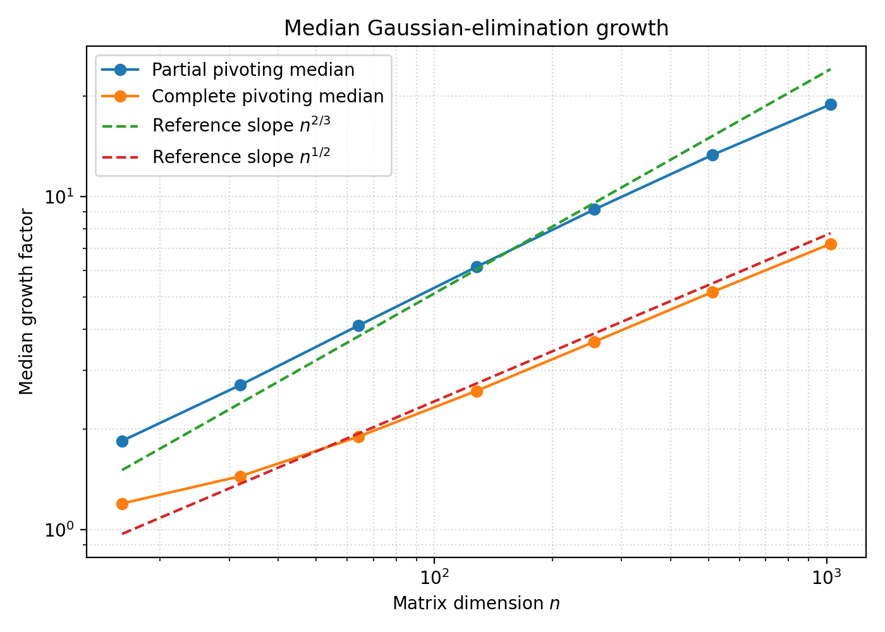

# Gaussian Elimination and Growth Factors

Implementations of Gaussian elimination with no pivoting, partial pivoting and complete pivoting in Julia.

The complete-pivoting growth tracker records the maximum absolute entry at every elimination stage and computes

\[
\rho(A) =
\frac{\max_k \|A^{(k)}\|_{\max}}
     {\|A\|_{\max}}.
\]

It is independently checked against various invariants and a separate Schur-complement implementation.

Tests:

```bash
julia --startup-file=no test_complete.jl
julia --startup-file=no test_partial.jl
julia --startup-file=no test_solve_partial.jl
julia --startup-file=no test_growth_complete.jl
julia --startup-file=no test_growth_partial.jl
```

## Average-growth experiment

Generate the paired Gaussian-matrix data:

```bash
julia --startup-file=no average_growth_experiments/average_growth.jl
```

Validate and generate the median-growth figure:

```bash
python3 average_growth_experiments/graph.py
```

This produced:



## g5 Verification

See README.md in g5

## Development Note

I implemented the elimination and growth-tracking routines while learning numerical linear algebra and Julia. I used an AI coding assistant for syntax guidance, code review, testing and experiment scaffolding, and visualization. All numerical results were generated locally and checked against separate Schur-complement calculations.